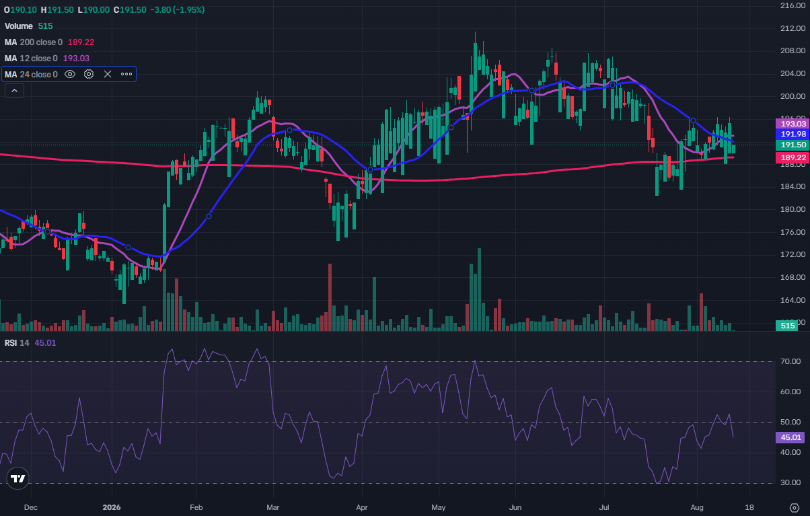

# SwingTrading

> **This is not financial advice. Use this software entirely at your own risk.**
> Trading can result in substantial financial loss, and market data, technical
> signals and AI-generated research can all be incomplete or incorrect. Always
> test a strategy thoroughly with a paper-trading account before considering its
> use with a live account and real money.

## Quickest route: run it inside Codex

The quickest way to use this project is to ask Codex to clone the repository,
install its dependencies, scan the current company universe supplied in
`data/us_uk_large_mid_mega_cap.csv` with a 12-day short and 24-day medium moving
average, and then analyse the resulting BUY candidates fundamentally. This lets
Codex perform the installation, technical screen and structured fundamental
review as one workflow instead of requiring you to step through every stage
individually.

You can give Codex this instruction:

> Clone `https://github.com/acnash/SwingTrading.git`, install the required
> dependencies, run the companies in `data/us_uk_large_mid_mega_cap.csv` using a
> 12-day short and 24-day medium moving-average crossover, then feed the BUY
> results through three separate, independent fundamental and recent-news reviews,
> then use `render_ai_review.py` to calculate a three-review consensus mean score.
> Summarise the consensus classifications and distinguish actionable entries
> from signals waiting for a pullback or further confirmation.

Codex should inspect the commands and generated evidence before drawing a
conclusion. The resulting classifications are research outputs rather than trade
instructions, and every candidate should be independently verified.

SwingTrading is a research-oriented moving-average crossover screener for the
S&P 500, FTSE 100, and optional custom watchlists. It uses completed daily
candles from Yahoo Finance and produces deterministic technical signals for
subsequent fundamental and news review.

> This software is for research and screening. It does not execute trades and
> does not provide investment advice. Market data can be delayed, incomplete,
> or adjusted. Verify every signal independently before making a decision.

Default rule:
- BUY: 20-day SMA crosses above 50-day SMA.
- SELL: 20-day SMA crosses below 50-day SMA.

## Example: Premier Foods 12/24 BUY signal



This Premier Foods (`PFD.L`) daily chart demonstrates the shorter crossover
configuration used in the example full-market run. It displays the 12-day SMA,
24-day SMA and 200-day SMA together with RSI(14) and daily volume. The 12-day
average crossed above the 24-day average, generating a technical BUY signal,
while the entry filters found moderate RSI and limited price extension.

The subsequent fundamental review awarded Premier Foods an 80% evidence-support
score, classified as `STRONGLY SUPPORTS BUY SIGNAL`. That percentage measures how
strongly the available fundamentals, guidance, recent news and supplied technical
context support the crossover. It is not a forecast or an expected investment
return.

## Install

```bash
python -m venv .venv
pip install -r requirements.txt
```

Activate the environment first with `source .venv/bin/activate` on macOS/Linux
or `.venv\Scripts\Activate.ps1` in Windows PowerShell.

## Run

```bash
python stock_signal_screener.py
```

Outputs are written to `output/`:
- `all_signals.csv`
- `buy_signals.csv`
- `actionable_buy_signals.csv`
- `wait_for_pullback_signals.csv`
- `wait_for_confirmation_signals.csv`
- `wait_for_volume_confirmation_signals.csv`
- `sell_signals.csv`
- `failed_symbols.csv`
- `buy_signal_review_prompt_1.txt`
- `buy_signal_review_prompt_2.txt`
- `buy_signal_review_prompt_3.txt`

`failed_symbols.csv` records unavailable symbols and insufficient histories so a
partial market-data response cannot pass silently.

Run each numbered prompt in a separate Codex task so that every reviewer reaches
its conclusion independently. Save their JSON arrays as `ai_review_1.json`,
`ai_review_2.json` and `ai_review_3.json`, then aggregate them with:

```bash
python render_ai_review.py ai_review_1.json ai_review_2.json ai_review_3.json \
  --output-csv fundamental_consensus.csv
```

The renderer requires exactly three files, checks that they contain the same
tickers, and returns a three-review consensus mean score together with the score
range. It derives the final classification from the rounded consensus mean.
`BUY CANDIDATE` requires a mean score of at
least 65%, `WATCH / NO TRADE` covers 50% to 64%, and a score below 50% produces
`REJECT BUY / REVIEW EXIT`. These labels support research decisions and remain
subject to the technical entry status, independent verification and risk controls.

## Change the moving-average windows

For example, 10-day / 30-day:

```bash
python stock_signal_screener.py --short 10 --medium 30
```

## Responsible market-data access

Daily histories come from Yahoo Finance through the unofficial `yfinance`
package. The defaults deliberately trade speed for reliability and lower
request pressure:

- 25 symbols per batch
- no more than four `yfinance` worker threads
- a random two-to-four-second pause between live batches
- exponential backoff and three retries for failed symbols only
- a persistent `.cache/market_data` cache with a 12-hour freshness window

An ordinary second run within 12 hours uses the local cache. Force a new fetch
only when required:

```bash
python stock_signal_screener.py --refresh-cache
```

The controls are configurable, for example:

```bash
python stock_signal_screener.py --batch-size 20 --threads 2 \
  --min-pause 3 --max-pause 6 --max-retries 4
```

Avoid scheduling overlapping runs, because separate processes do not share a
rate limiter.

## Late-entry protection

Every raw BUY crossover is assigned an entry status. The default safeguards are:

- `WAIT_FOR_PULLBACK` when RSI(14) is at least 68, price is at least 4% above
  the short SMA, or the five-day gain is at least 8%
- `WAIT_FOR_CONFIRMATION` when price is within 2% of its prior 60-session high
  and fewer than two of the last three sessions traded at 1.2 times their
  respective 20-day average volumes
- `ACTIONABLE_BUY` when neither condition applies

## Volume Flow Indicator confirmation

Every signal now includes a deterministic 0-to-100 VFI BUY confirmation index.
The implementation uses a 130-session VFI, 30-session volatility threshold, 2.5
times average-volume cap, 0.2 coefficient and five-session EMA signal line. The
index awards points for positive VFI, position above its signal line, a recent
bullish signal-line cross, positive five-session direction, improvement over 20
sessions and proximity to its 20-session high.

- 80-100: `STRONG_ACCUMULATION`
- 65-79: `SUPPORTS_BUY`
- 50-64: `MIXED_EARLY_ACCUMULATION`
- 35-49: `WEAK_VOLUME_SUPPORT`
- 0-34: `DISTRIBUTION_OR_ABSENT_SUPPORT`

An otherwise actionable crossover with an available VFI index below 50 becomes
`WAIT_FOR_VOLUME_CONFIRMATION`. VFI remains a confirmation layer alongside the
12/24 crossover and the three-review fundamental consensus mean; the scores are
kept separate so technical and fundamental weaknesses remain visible.

These filters do not rewrite the original 20/50 crossover. They separate trend
detection from entry timing. Every threshold has a corresponding command-line
option, including `--max-rsi`, `--max-short-extension-pct`,
`--max-five-day-gain-pct`, and the resistance and volume-confirmation options.

### 200-day trend confirmation

The 200-day SMA is currently a confirmation factor rather than a hard rejection
rule. A valid short/medium crossover can therefore remain a raw BUY signal when
its closing price is below the 200-day SMA, allowing the screener to identify a
possible early recovery. In the generated AI-review rubric, a close above the
200-day SMA earns five technical-support points; a close below it earns zero.

Candidates below the 200-day SMA should normally remain on the watchlist until a
completed daily candle closes back above that average, preferably with improving
volume. The screener does not currently assign a dedicated
`WAIT_FOR_200_SMA_RECLAIM` status, so this additional decision is made during the
fundamental and technical review stage.

## Add your own shares

Create a CSV:

```csv
ticker,company,market
AAPL,Apple Inc.,US
AZN.L,AstraZeneca PLC,UK
```

Then:

```bash
python stock_signal_screener.py --custom-csv my_stocks.csv
```

You can use `--no-sp500` and/or `--no-ftse100` to disable the built-in universes.

## Bundled US and UK large/mid-cap universe

The repository includes `data/us_uk_large_mid_mega_cap.csv`, containing S&P 500,
FTSE 100, and FTSE 250 constituents in the screener's required
`ticker,company,market` format. These indices provide a liquid large-, mega-,
and mid-cap universe while excluding penny-stock and micro-cap universes by
construction.

Run only the bundled list with:

```bash
python stock_signal_screener.py --no-sp500 --no-ftse100 \
  --custom-csv data/us_uk_large_mid_mega_cap.csv
```

The committed file was generated on 14 August 2026. Index membership changes,
so regenerate it from the current public constituent tables when needed:

```bash
python tools/update_universe.py
```

## Tests

```bash
pip install -r requirements-dev.txt
python -m pytest
```

The tests exercise symbol normalisation and BUY/SELL crossover classification
without downloading market data.

## Important

Run after the relevant market has closed if you want the newest daily candle to represent a completed session.
The "Evidence support %" generated by the AI rubric is not a probability of profit or a recommendation to trade.

The constituents are retrieved from public web tables at runtime, so upstream
page changes can temporarily break universe discovery. Yahoo Finance access is
provided through the unofficial `yfinance` client and is subject to its own
availability and terms.
